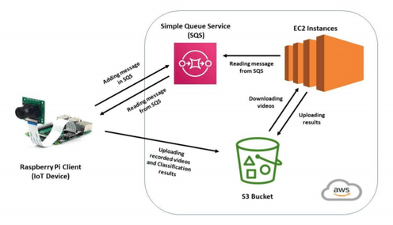

# Intelligent Surveillance

### Introduction

In this project, we have developed the surveillance system using Raspberry pi as an IOT device and AWS for Auto-Scaling the application. The Raspberry Pi has a camera and motion sensor attached to it. The camera captures the intruder and records a video. Then the object detection in a recorded video is done using the lightweight deep learning framework, Darknet, on the Raspberry Pi. However, to minimize the end to end latency of object detection, we make use of AWS, a IaaS provider, EC2 instances for computing and S3 (Simple Storage Service) storage to achieve it. Also, we used SQS (Simple Queue Service) which helps in load balancing the workload of surveillance systems between the Raspberry Pi, an Edge Computing device, and the AWS. 

#### Overview Architecture of Surveillance system

  

Following are the setup instruction for different components of the system taken into accout:

#### Raspberry Pi

● Download ​Etcher​ (​https://www.balena.io/etcher/​), a tool for flashing OS images to SD cards, to the host computer. Download the ​Raspbian​ image using the following link https://drive.google.com/open?id=1ORRN0qI4uOuyQtsQa4jMlIm4WcoRtNTa​. ​Flash the Raspbian image to a microSD card using Etcher. Plug the card to the Raspberry Pi (we will call it the ​Pi​ hereinafter) and power it up.

● Setting up Uart serial console cable- Install the windows driver from the following link - https://www.pololu.com/file/0J14/pololu-cp2102-windows-121204.zip . The ground pin out from Uart is connected to GPIO pin 14, the TXD pin out from Uart is connected to GPIO pin 10(RXD) and the RXD pin out from Uart is connected to GPIO pin 8(TXD). Modify the file ​/boot/config.txt ​on Pi, and add the following line: dtoverlay=pi3-miniuart-bt . ​Connect the USB to the computer and start Putty. Enter the username and password to login into the pi.

● Install Java on Raspberry Pi to run jar - Use the command ​sudo apt install openjdk-8-jdk-headless ​to run jar files on raspberry pi.

● Install the Raspberry Pi Camera module by inserting the cable into the Raspberry Pi. The cable slots into the connector situated between the Ethernet and HDMI ports, with the silver connectors facing the HDMI port. Boot up your Raspberry Pi and from the prompt, run "​sudo raspi-config"​ to see the camera option listed in the configurations.

● Install the Motion PIR sensor by co connecting it with the female wire jumpers into the three pins on the PIR sensor as shown in the picture below. The three pins are labelled as the following: Red; PIR-VCC (3-5VDC in), Brown; PIR-OUT (digital out) and Black; PIR-GND (ground). PIR-VCC goes into the 5V GPIO pin(Pin 1), PIR-GND goes into the GPIO ground pin(Pin 5) and PIR-OUT goes to the GPIO pin 7 to get motion signals when motion is made. We can manage the sensitivity of the PIR motion sensor by rotating the orange dials as per our requirement.

● Environment setup on startup- Place the command ​Xvfb :1 & export DISPLAY=:1 which is used to run the darknet code on systems without displays, in the ~/.bashrc file.
    
#### Executor EC2 (Slave Code)

● Install Java on EC2 to run the jar - Use the command ​sudo apt install openjdk-8-jdk-headless ​to run jar files on EC2.

● Environment setup on startup- Make a startup script as given below and name is startup.sh at /home/ubuntu

● Place the jar file cse546_ec2.jar at /home/ubuntu and make a /home/ubuntu/work directory to store the video and result file.

#### Master EC2 (Master Code)

● Install Java on EC2 to run the jar - Use the command ​sudo apt install openjdk-8-jdk-headless ​to run jar files on EC2.

● Place the jar file cse546_master.jar at /home/ubuntu.
